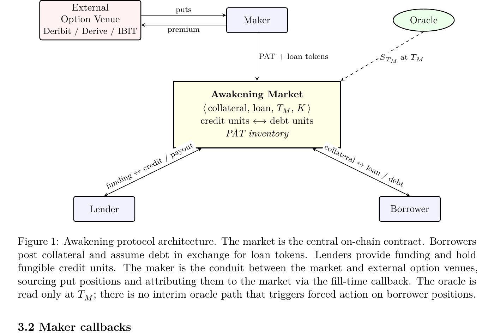
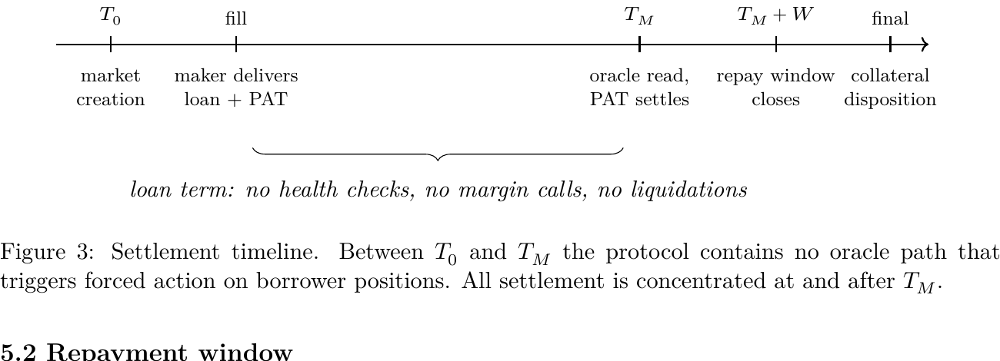

# Hyperloop Finance: A Non-Liquidative Lending Protocol with Option Attribution

**Every crypto lending market before Awakening protected the lender by liquidating the borrower. Awakening protects the lender with math.**

The entire protocol reduces to a single identity, evaluated at loan maturity $T_M$:

$$\underbrace{\min(S_{T_M},\, K)}_{\text{collateral value}} + \underbrace{\max(K - S_{T_M},\, 0)}_{\text{put payoff}} = K$$

This holds for every terminal collateral price $S_{T_M} \geq 0$. Each credit unit in a market pays exactly $K$ loan tokens at maturity, regardless of what the collateral does during the term. **No oracle read during the term. No health check. No margin call. No liquidator. Path-independent by construction.**

Hyperloop Awakening is on-chain credit for real balance sheets. It removes the single feature that has kept treasuries, family offices, and long-duration holders off DeFi — **path-dependent forced liquidation** — and replaces it with a per-loan put option whose payoff is guaranteed by the identity above.

- **For Lenders:** Principal is protected by an attached put option, not by an oracle-triggered liquidation engine. **Zero bad debt** from cascades. No dependence on liquidator networks. Per-unit recovery at maturity is $R(S_{T_M}) = \min(S_{T_M}, K) + \max(K - S_{T_M}, 0) = K$ — flat across every terminal price.
- **For Borrowers:** No margin calls, no health checks, no interim liquidations. At maturity: **repay and reclaim, or walk away** — loss is bounded by the pre-paid put premium. The advance rate is set by the strike, not by expected volatility: $\text{maxDebt} = K$, and $K$ can meet or exceed spot.
- **For Makers:** Publish executable offers across many strikes and maturities using a single option book. Break-even discount decomposes as $1 - P_{\text{offer}} \approx r_f \cdot \tau + P(K, \tau) + m \cdot \tau$ — hedge $P(K, \tau)$ externally on Deribit, Derive, IBIT-listed contracts, or bilateral OTC. The protocol only requires per-fill PAT delivery, not a standing hedge.

## Table of Contents

- [Abstract](#abstract)
- [Motivation: Why Existing DeFi Credit Excludes the Largest Cohort](#motivation-why-existing-defi-credit-excludes-the-largest-cohort)
- [Introducing Awakening: The Solution](#introducing-awakening-the-solution)
- [Protocol Architecture](#protocol-architecture)
- [Option Attribution and the Non-Liquidative Invariant](#option-attribution-and-the-non-liquidative-invariant)
- [Maturity Settlement](#maturity-settlement)
- [Worked Examples](#worked-examples)
- [Extensions: Zero-Coupon and Collared Products](#extensions-zero-coupon-and-collared-products)
- [Comparison to Existing Protocols](#comparison-to-existing-protocols)
- [Ecosystem Synergies and Strategic Impact](#ecosystem-synergies-and-strategic-impact)
- [Adoption Strategy](#adoption-strategy)
- [Access Control, Authorizations, and Fees](#access-control-authorizations-and-fees)
- [Roadmap](#roadmap)
- [References](#references)

## Glossary

A brief overview of the terms used throughout this document. Awakening deliberately reuses the Morpho Midnight vocabulary wherever the mechanics are inherited, and introduces new terms only where the protocol departs from prior art.

**Market Structure**

- **⟨Market $M$⟩**: an isolated, immutable, permissionlessly created lending market, uniquely parameterized by a collateral asset, a loan asset, an oracle, a maturity $T_M$, a strike $K$, a settlement contract, and optional access-control gates.
- **⟨Credit unit⟩**: a fungible on-chain claim held by a lender. Each credit unit pays one loan token at maturity when the non-liquidative invariant holds.
- **⟨Debt unit⟩**: the symmetric obligation held by a borrower. One debt unit is a commitment to repay one loan token at maturity.
- **⟨Advance rate⟩**: for a borrower posting one unit of collateral, the maximum debt that can be opened. Under Awakening, $\text{maxDebt} = K$; the advance rate is fixed by the strike, not by expected volatility.

**Option Attribution**

- **⟨Put Attribution Token (PAT)⟩**: a fungible on-chain wrapper around a put option position whose strike, notional, and expiry are aligned to a market's parameters. Delivered by the maker at fill time and settled at $T_M$ against the market's oracle read.
- **⟨PAT source⟩**: the origination venue of the put position wrapped by a PAT. Three canonical classes are supported: on-chain native, off-chain attested, and protocol-internal.

**Roles**

- **⟨Maker⟩**: an off-protocol participant that publishes executable offers and mediates between the market and one or more external option venues. Makers source both the loan tokens and the PAT at fill time via a callback.
- **⟨Borrower⟩**: the on-chain participant who posts collateral and receives loan tokens (net of premium).
- **⟨Lender⟩**: the on-chain participant who funds credit unit issuance and receives loan tokens at settlement.

**Loan Term Types**

- **⟨Margin loan⟩**: a collateralized loan subject to automated liquidation when collateral value falls below a threshold. The lender is protected by an oracle-driven liquidation path; the borrower bears path-dependent forced-sale risk.
- **⟨Non-liquidative loan⟩**: a collateralized loan whose lender protection is furnished by an attached put option rather than by a liquidation path. The borrower is never subject to a margin call or forced unwind during the term of the loan.

## Abstract

Hyperloop Awakening is a non-liquidative, fixed-rate, fixed-maturity collateralized lending protocol implemented for the Ethereum Virtual Machine. It is organized around isolated, immutable, permissionlessly created markets, each parameterized by a collateral asset, a loan asset, a maturity date, and a strike. Lending and borrowing are implemented through the trading of credit and debt units whose payoff structure is analogous to that of zero-coupon obligations, settling at the market's maturity. The defining property of the protocol is that borrowers are never subject to interim liquidation: lender principal is protected by a put option attributed to each loan at origination, whose strike, notional, and expiry are aligned one-to-one with the market parameters. Liquidity is sourced through an offer-based market in the style of Morpho Midnight: makers publish executable offers that do not lock capital, and source the loan asset together with the corresponding option position only at settlement. The resulting design lets sophisticated makers concurrently quote across multiple maturities and strikes while hedging their exposure on existing on-chain and centralized option venues, and lets borrowers obtain fixed-term, fixed-rate financing without exposure to forced unwinds during the term of the loan.

## Motivation: Why Existing DeFi Credit Excludes the Largest Cohort

Crypto-collateralized lending has converged onto a small set of architectural choices: variable-rate, perpetual-term, oracle-driven, and liquidation-based. These choices serve short-term, leverage-seeking, liquid-collateral borrowers well, but exclude **two categories of demand that today are served almost exclusively off-chain**.

### 1. The Long-Duration Holder

The first excluded category is the *long-duration holder*: a treasury, family office, or listed-company shareholder who holds a concentrated position in a digital asset, requires liquidity against it, and is unwilling to accept the path-dependent risk of being liquidated during a drawdown the borrower considers temporary.

For this borrower, the **expected cost of liquidation — conditional on a 50% intra-loan drawdown that recovers before maturity — can exceed the entire interest cost of the loan**. The economically rational response is to refuse the product, and the empirical response, historically, has been to seek bilateral OTC financing with structured downside protection.

> [!NOTE]
> There is a common misconception that automated, oracle-triggered liquidations are the only way to protect lenders from volatile collateral. **This is empirically false.** For decades, bilateral OTC desks (Matrixport, Galaxy, Genesis, Cumberland) have offered non-margin BTC-backed loans by pricing the downside as an embedded option rather than by relying on forced sales. Awakening reproduces that payoff structure on a permissionless substrate.

### 2. The Predictable-Funding Borrower

The second excluded category is the *predictable-funding borrower*: a participant who needs to commit to a fixed cost of capital for a known period, typically because the use of proceeds itself has a fixed horizon. Variable-rate, perpetual-term pools cannot serve this need without imposing rate risk that defeats the use case.

### 3. Path-Dependent Liquidation as the Structural Barrier

Aave, Compound, and Morpho Blue liquidate on any oracle touch below the health threshold. A single transient drawdown can terminate a position that would have fully recovered by maturity. Morpho Midnight addresses the second category above by introducing fixed-rate, fixed-maturity markets, but retains a liquidation path bounded by an expected-volatility LTV. The first category — the long-duration cohort — remains structurally excluded.

**The economic mismatch is not a UX problem, a rate problem, or a duration problem. It is a product problem: the collateral needs to be protected by an option, not by a liquidation engine.**

## Introducing Awakening: The Solution

Awakening extends the Morpho Midnight architecture with a single structural property: **every loan opened in a market is implicitly backed by a put option on the collateral, with strike, notional, and expiry aligned to the market's parameters**. The put is the protocol's substitute for liquidation.

A borrower is never subject to a margin call or forced unwind during the term of the loan. Instead, if the collateral terminates below strike at maturity, the put pays out, the lender receives the full notional of their credit, and the borrower has the choice of repaying and recovering the collateral or walking away.

This single change has substantial consequences:

- **The fixed loan term and the fixed option expiry coincide structurally.** A 90-day loan against a 90-day put is one product, not two.
- **The fixed loan rate naturally incorporates the put premium.** Borrowers see one rate; makers price the put internally.
- **The advance rate (LTV) is no longer a function of expected volatility multiplied by a liquidation buffer.** It is a function of the strike chosen, full stop. Strikes can be set at 100% of spot or higher, because there is no liquidation event to defend against.
- **The maker's quote is no longer constrained by their willingness to hold uncovered downside risk.** Sophisticated makers can hedge the option exposure on external venues — Deribit, Derive, IBIT-listed contracts, or bilateral OTC — and quote against the *net* funding cost.

> [!NOTE]
> The put option is delivered by the maker at fill time, not sourced from a shared protocol pool. This decouples the protocol from the option origination venue and lets a single maker aggregate an option book across many Awakening markets simultaneously.

## Protocol Architecture

Awakening is organized around **isolated, immutable markets with configurations that cannot be altered after creation**. Each market is uniquely specified by the tuple

$$M = \langle \text{collateral},\, \text{loan},\, \text{oracle},\, T_M,\, K,\, \text{settlement},\, \text{gates} \rangle$$

where:

- *collateral* is the ERC-20 token posted by borrowers.
- *loan* is the ERC-20 token in which credit, debt, and interest are denominated.
- *oracle* is the price feed used at maturity for the strike comparison.
- *maturity* $T_M$ is the timestamp at which the market settles. By convention $T_M$ is chosen to coincide with a recognized option expiry calendar (weekly, monthly, or quarterly) on a reference option venue.
- *strike* $K$ is the per-unit collateral price below which the embedded put position pays out at maturity. $K$ is denominated in *loan per collateral*.
- *settlement* is the contract that executes the per-loan put attribution and maturity settlement.
- *gates* are optional access-control contracts (see [Access Control](#access-control-authorizations-and-fees)).

The market's *advance rate* is implied by its strike: for a borrower posting one unit of collateral, the maximum debt that can be opened is bounded by

$$\text{maxDebt} = K$$

**This identity is exact, and does not depend on an expected volatility input.** It holds for any $K$; markets may be created with $K$ above the prevailing spot, allowing advance rates above 100%, provided makers are willing to quote against them.

### Actors and Asset Flows

The Awakening market is the central on-chain contract. Borrowers and lenders interact with the market directly. The **maker** is an off-protocol participant that mediates between the market and one or more external option venues: it sources put (and, in the generalized product of Section 11, call) positions externally and attributes them to the market at fill time. The oracle is a passive component, read only at maturity.

The oracle is read only at $T_M$; there is no interim oracle path that triggers forced action on borrower positions.

### Fungibility

Every trade involves a buyer and a seller, but settlement results in **fungible positions within the market** rather than in a lasting bilateral relationship. Credit and debt are accounted for at the market level, and positions are not tied to the particular trade that created them.

As markets mature on fixed calendar dates rather than on rolling tenors from origination, positions created at different times but with the same $T_M$ and $K$ belong to the same market and are fungible with one another. The put attribution attached to each credit unit is also fungible at the market level: **the lender's protection is an aggregate of the market's hedge inventory**, not a bilateral position against any single borrower.

### Early Exits

Within a market, existing lenders and borrowers can reduce their outstanding credit and debt at any time by selling and buying units respectively. A buyer closes out any debt before accumulating credit, and a seller closes out any credit before accumulating debt. Early exits deepen liquidity for all participants, since entries and exits occur within the same unified market.

## Option Attribution and the Non-Liquidative Invariant

The defining invariant of the protocol is: at maturity, each credit unit in a market $M$ pays one *loan* token, regardless of the terminal collateral price $S_{T_M}$. This is the **non-liquidative invariant**. It holds without recourse to liquidation, margin call, or oracle-triggered position closure during the term of any loan.

The invariant is sustained by attribution of put option positions to credit units. For a market with strike $K$, maturity $T_M$, collateral $C$, and loan asset $L$, the attached put has terminal payoff (per unit of collateral notional)

$$\Pi(S_{T_M}) = \max(K - S_{T_M},\, 0)$$

denominated in $L$. Combined with the collateral itself, the lender's per-unit recovery at $T_M$ is

$$R(S_{T_M}) = \min(S_{T_M}, K) + \Pi(S_{T_M}) = K$$

which is exactly the *maxDebt* of the loan. This identity, evaluated at any terminal price, is the algebraic source of the invariant.

> [!NOTE]
> The identity $\min(S, K) + \max(K - S, 0) = K$ is the entire economic engine of Awakening. It holds at every terminal price $S_{T_M} \geq 0$. Nothing in the protocol depends on volatility assumptions, liquidation thresholds, or oracle behavior during the term.

### Attribution at Fill Time

When an offer is filled, the maker callback is responsible for delivering both:

1. **The loan tokens** corresponding to the credit being created, and
2. **A Put Attribution Token (PAT)** representing a claim on the put payoff $\Pi(S_{T_M})$ scaled to the loan's notional.

The protocol enforces that the PAT supplied to the market satisfies four alignment constraints:

- *Underlying alignment*: the PAT references the same collateral asset $C$ as the market.
- *Strike alignment*: the PAT references the same strike $K$ as the market.
- *Maturity alignment*: the PAT references the same maturity $T_M$ as the market, or an expiry within a configurable tolerance window $[T_M - \tau, T_M]$ where $\tau$ defaults to zero.
- *Notional sufficiency*: the PAT's underlying notional is at least the collateral notional implied by the loan size.

If any of these constraints fails, the callback reverts, the offer is not filled, and no credit or debt is created.

### PAT Sources

A PAT is a thin wrapper around a put position, exposing a uniform settlement interface to the Awakening settlement contract. The wrapper is opaque with respect to the put's origination venue. In current practice three classes of source are supported:

1. **On-chain native**: PATs minted against put positions on Derive, Premia, or Panoptic, wrapped by a verification adapter that asserts the underlying option's parameters at mint time.
2. **Off-chain attested**: PATs minted against put positions held with a qualified custodian (e.g., on Deribit by Coinbase, on IBIT-listed contracts via a regulated U.S. broker), where the custodian attests to the position via a signed feed. Settlement at $T_M$ is funded by the custodian against the attestation.
3. **Protocol-internal**: PATs minted against an Awakening-internal put writer pool, where a separate set of makers post collateral and write puts directly to the protocol. This source exists for markets in which external venues do not list the required strike or maturity.

**The PAT abstraction allows a single market to be backed by a heterogeneous mixture of these sources.** The market does not need to know which source backs which credit unit; the only invariant is that the aggregate PAT inventory in the market covers the aggregate credit issuance at $T_M$.

### Premium Funding

The cost of the put is borne by the borrower, embedded in the rate at which they sell debt units. For a market with strike $K$, maturity $T_M$, and time-to-maturity $\tau = T_M - t$, the borrower's all-in rate decomposes notionally as

$$r(t) = r_f(\tau) + \frac{P(K,\tau)}{\tau} + m$$

where:

- $r_f(\tau)$ is the term-matched risk-free rate (in practice, a stablecoin term curve).
- $P(K,\tau)$ is the prevailing put premium per unit notional.
- $m$ is the maker's margin.

The protocol does not enforce this decomposition. It is supplied here as the economic reference that explains why fixed-rate offers in Awakening price the way they do, and why a market's offer curve will tend to shift in lockstep with the put's implied volatility on external venues.

### Maker Hedging Discipline

A maker quoting in Awakening is, in effect, simultaneously:

- Selling a zero-coupon obligation (the credit unit), and
- Holding (or sourcing) a put position to attribute at fill time.

The maker's net delta with respect to $S_{T_M}$ is, by construction, zero with respect to the credit unit alone (zero-coupon payoff does not depend on $S$) and matches the put's delta with respect to the attribution. A maker who holds an opposing put position on the same underlying (sourced from another market-maker on Deribit, for instance) is therefore approximately delta-flat across the combined book.

The protocol does not impose a hedging requirement on makers beyond the per-fill PAT delivery. Makers may run net long or net short option books between fills, subject to their own risk management. The PAT attribution at fill time is sufficient to guarantee the lender's payoff at $T_M$.

## Maturity Settlement

At $T_M$, the market's settlement contract executes the following sequence, atomically per market:

1. Read $S_{T_M}$ from the market's oracle.
2. Compute the total credit outstanding $C_{T_M}$ in loan tokens.
3. Compute the total collateral outstanding $X_{T_M}$ in collateral tokens.
4. Compute the put payoff per collateral unit $\Pi(S_{T_M}) = \max(K - S_{T_M}, 0)$.
5. Aggregate PAT settlement: redeem all PATs in the market, receiving $X_{T_M} \cdot \Pi(S_{T_M})$ in loan tokens from the PAT sources.
6. Open the *repayment window*.

Between $T_0$ and $T_M$ the protocol contains **no oracle path** that triggers forced action on borrower positions. All settlement is concentrated at and after $T_M$.

### Repayment Window

For a configurable window $W$ (default 24 hours) after $T_M$, borrowers may repay their outstanding debt $L$ in loan tokens and withdraw their collateral. The repayment amount is exactly the debt; there is no late penalty inside the window.

This is the rational path for borrowers when $S_{T_M} > K$: they recover collateral worth more than the loan amount.

### Collateral Disposition After Window

If the borrower has not repaid by $T_M + W$, the collateral is released to the settlement contract. The collateral is then aggregated with the put payoff and used to satisfy lender claims:

- Each credit unit is redeemed for one loan token.
- The settlement pool's solvency is the algebraic identity of Section 4.1: $\min(S, K) + \max(K - S, 0) = K$ per unit of collateral, which is by construction the maxDebt and therefore covers all outstanding credit.

Any residual surplus (which can arise if the put payoff exceeds the credit issuance, due to PAT over-attribution) accrues to the market's *surplus role*, configurable at market creation.

### No Interim Liquidations

There is no oracle path during $t < T_M$ that triggers any forced action on borrower positions. Specifically:

- No health check during the term.
- No price-triggered margin call.
- No third-party liquidator role active before $T_M$.

**This is the structural difference from Midnight, Morpho Blue, Aave, and Compound, all of which contain liquidation paths during the loan term.** The cost of removing those paths is the put premium, which is priced into $r$ at origination.

### Bad Debt

In the absence of PAT failure (see below), **there is no bad debt**: the non-liquidative invariant guarantees full credit redemption.

### PAT Failure

If at $T_M$ a PAT source fails to deliver the contracted put payoff (e.g., a custodial attestor defaults, or an on-chain protocol becomes insolvent), the affected market enters a *shortfall* state. In shortfall:

- The settlement contract redistributes available recoveries pro-rata across credit units.
- Trading in the market remains open post-maturity to allow informed exit.
- Future markets created against the same PAT source may be gated against (see [Access Control](#access-control-authorizations-and-fees)).

**PAT source diversification** across on-chain native, off-chain attested, and protocol-internal sources is the protocol's primary defense against this risk. Source concentration is not enforced at the protocol layer; it is a curatorial decision at market creation and at maker-quoting time.

## Worked Examples

The following examples illustrate the protocol's mechanics with concrete numbers. All figures are illustrative and do not reflect any actual quote. Throughout, the collateral asset is BTC, the loan asset is USDC, and prices are quoted in USDC per BTC. Premium estimates assume a 60% annualized BTC implied volatility on the reference put.

### Example A: At-the-Money 90-Day Loan

At $T_0$, BTC trades at $S_0 = \$100{,}000$. A market $M_A$ is created with $K = \$100{,}000$ and $T_M = T_0 + 90$ days. The corresponding 90-day, \$100,000-strike BTC put trades on a reference venue at approximately \$5,000 per BTC.

A maker publishes an offer to purchase debt units at price $P = 0.935$, implying an annualized rate of approximately **28%**. The borrower posts 1 BTC of collateral and consumes the full offer for a notional of 100,000 debt units.

The maker callback delivers:

- **93,500 USDC** to the borrower,
- **A PAT** representing a \$100,000-strike put on 1 BTC expiring at $T_M$, sourced from the maker's external put inventory.

The market state after fill: 100,000 credit units issued, 100,000 debt units owed, 1 BTC of collateral locked, 1 BTC of put notional attributed.

Settlement at $T_M$ proceeds along three representative paths:

| Case | $S_{T_M}$ | Borrower action | Lender receives | Borrower terminal P&L |
|:-:|:-:|:-:|:-:|:-:|
| 1 | \$120,000 | repays 100,000 USDC | 100,000 USDC | **+\$13,500** |
| 2 | \$100,000 | indifferent | 100,000 USDC | -\$6,500 |
| 3 | \$60,000 | **walks away** | 60,000 + 40,000 (put) = **100,000 USDC** | **-\$6,500** |

In Case 3, the unhedged BTC holder would have realized a \$40,000 loss against $T_0$. **The Awakening borrower's loss is bounded at the loan discount (\$6,500)**, which is the explicit cost of the embedded put protection. The borrower retains the option to repay and recover the collateral in any state; doing so is rational whenever $S_{T_M} > L = \$100{,}000$.

### Example B: Below-Spot Strike, Lower Premium

At $T_0$, BTC again trades at $S_0 = \$100{,}000$. A market $M_B$ is created with $K = \$80{,}000$ (an 80% advance rate) and $T_M = T_0 + 90$ days. The corresponding 80,000-strike, 90-day put trades at approximately \$2,500 per BTC, materially below the at-the-money premium of Example A.

A maker quotes at $P = 0.965$ (annualized rate ≈ **14%**). The borrower posts 1 BTC and consumes 80,000 debt units. The callback delivers 77,200 USDC and an 80,000-strike PAT.

| Case | $S_{T_M}$ | Borrower action | Lender receives | Borrower terminal P&L |
|:-:|:-:|:-:|:-:|:-:|
| 1 | \$120,000 | repays 80,000 | 80,000 USDC | **+\$37,200** |
| 2 | \$90,000 | repays 80,000 | 80,000 USDC | +\$7,200 |
| 3 | \$50,000 | walks away | 50,000 + 30,000 (put) = 80,000 USDC | -\$2,800 |

Relative to Example A, the borrower trades a lower advance (\$77,200 vs \$93,500) for a **substantially lower funding cost** and a wider downside before the put begins to compensate.

### Example C: Comparison to a Midnight-Style Liquidation Loan

Consider a hypothetical Midnight market on the same collateral with a liquidation LTV of 80% and a fixed annualized rate of $r_M = 10\%$. Compare to Example B:

- The Midnight loan funds at a lower rate (10% vs 14%). The 4% spread is, mechanically, the implied premium for path-independence.
- During the term, if $S_t$ falls below the liquidation threshold even transiently, the Midnight position is liquidatable. The borrower forfeits collateral at the liquidation price, regardless of $S_{T_M}$.
- The Awakening position is not liquidatable during the term. Consider a path with $S_{T_M/2} = \$50{,}000$ (deep below the liquidation threshold) but $S_{T_M} = \$90{,}000$:
  - The Midnight borrower has been liquidated and has no collateral to recover.
  - The Awakening borrower repays \$80,000 at $T_M$ and retrieves BTC worth \$90,000.

**The path-dependence premium is the economic value the borrower pays for the option to ride a drawdown.** Whether this premium is worth paying is a function of the borrower's view on intra-term volatility and on the conditional distribution of recovery paths.

## Extensions: Zero-Coupon and Collared Products

The base Awakening market attaches a single option claim — a put — to each loan, with the cost borne by the borrower through the loan discount. The same offer-based, fixed-term primitive admits a natural generalization: the market parameters can specify **multiple option claims**, with premiums flowing in either direction. This unlocks a family of structured products on the same infrastructure, including the zero-coupon collared loan implemented bilaterally off-chain by Matrixport's Zero Cost Loan and analogous facilities offered by Galaxy, Cumberland, and other prime brokers.

### Generalized Market Specification

A generalized Awakening market is specified by

$$M = \langle \text{collateral},\, \text{loan},\, \text{oracle},\, T_M,\, K_{\text{put}},\, K_{\text{call}},\, \text{settlement},\, \text{gates} \rangle$$

with $K_{\text{put}} \leq K_{\text{call}}$. The base product corresponds to $K_{\text{call}} = +\infty$. The settlement contract attributes both a long put (to the credit side) and a short call (to the debt side) at fill time.

### Borrower and Lender Payoffs

At $T_M$, per unit of collateral:

- The lender receives $\min(S_{T_M}, K_{\text{put}}) + \max(K_{\text{put}} - S_{T_M}, 0) = K_{\text{put}}$, preserving the non-liquidative invariant on the credit side.
- The borrower's terminal collateral claim is $\min(S_{T_M}, K_{\text{call}})$, because the attached short call assigns away any upside above $K_{\text{call}}$.

The borrower's effective payoff profile is therefore a **collar**: floored below at $K_{\text{put}}$ (the floor implicit in the loan amount) and capped above at $K_{\text{call}}$ (the ceiling implicit in the assigned call).

### The Zero-Coupon Case

Let $P(K, \tau)$ denote the put premium at strike $K$ and tenor $\tau$, and $C(K, \tau)$ denote the call premium at strike $K$. The maker's break-even discount on the borrower's debt unit is approximately

$$1 - P_{\text{offer}} \approx r_f \cdot \tau + P(K_{\text{put}}, \tau) - C(K_{\text{call}}, \tau) + m \cdot \tau$$

where $r_f$ is the term-matched risk-free rate and $m$ is the maker's margin. If $K_{\text{call}}$ is chosen such that

$$C(K_{\text{call}}, \tau) = P(K_{\text{put}}, \tau) + r_f \cdot \tau$$

the discount collapses to $m \cdot \tau$. The borrower receives essentially the full advance at $T_0$ and owes exactly the same amount at $T_M$: a **zero-coupon loan**. The implied price is the surrender of all collateral upside above $K_{\text{call}}$.

For BTC at $K_{\text{put}} = S_0$, the zero-coupon call strike depends on the prevailing volatility surface but is empirically in the range $K_{\text{call}} \in [1.15 \cdot S_0, 1.30 \cdot S_0]$ for $\tau \in [60, 180]$ days at the implied volatilities observed during 2025-2026. Tighter call strikes are achievable when the put strike is set below spot, since the financed premium is smaller.

### Other Payoff Profiles

The same generalization expresses other points on the borrower's risk-payoff frontier:

- **Yield-enhanced loan** ($K_{\text{call}}$ tight relative to $S_0$, $K_{\text{put}} = S_0$): the borrower receives *more* than the loan amount at $T_0$ (a negative effective rate) in exchange for a tight upside cap. Suitable for borrowers with a high-conviction range-bound view.
- **Wide collar** ($K_{\text{call}}$ wide, partial premium offset): the borrower pays a positive but reduced rate and retains most upside. The intermediate point on the frontier.
- **Risk reversal loan** ($K_{\text{put}} \ll S_0$, $K_{\text{call}}$ modestly above $S_0$): the borrower accepts a tail of unhedged downside (below $K_{\text{put}}$) in exchange for a tighter premium and a higher cap. The loan amount is bounded by $K_{\text{put}}$, which is below spot.

Each is a distinct point on the same two-dimensional surface parameterized by $(K_{\text{put}}, K_{\text{call}})$. The protocol does not privilege any region of this surface; market creators select the parameters and quoting makers signal their willingness to underwrite the resulting position by publishing offers.

## Comparison to Existing Protocols

### vs. Morpho Midnight

Midnight provides the intent-based, fixed-term, zero-coupon primitive on which Awakening builds. The differences are:

- Midnight is liquidation-based; Awakening is option-attribution-based.
- Midnight's loan-to-value is volatility-bounded; Awakening's is strike-bounded and can exceed 100%.
- Midnight's settlement is asynchronous (positions can be liquidated piecewise during the term); Awakening's is synchronous (settlement occurs at $T_M$).
- Midnight's maker callback sources loan tokens only; Awakening's sources loan tokens plus PAT.

A market in Midnight and a market in Awakening at the same collateral, loan, and maturity, with respective liquidation LTV and Awakening strike chosen such that they imply equivalent advance rates, are economically substitutable for the borrower except for (a) the price (Awakening will charge the put premium) and (b) the elimination of interim liquidation risk.

### vs. Morpho Blue / Aave / Compound

These protocols serve highly liquid collateral with continuous, oracle-driven liquidation. Awakening serves the demand for long-duration, drawdown-tolerant exposure. The two designs are **complementary**: a borrower seeking maximum capital efficiency on liquid collateral with no preference for path-independence will choose Morpho Blue; a borrower with the opposite preference profile will choose Awakening.

### vs. Matrixport NL Loan / Off-Chain Bilateral

Off-chain non-liquidative loans (NL Loan, Genesis structured loans, Galaxy bespoke facilities) are bilateral, opaque, custodial, and not composable. **Awakening reproduces the same payoff structure on a permissionless, non-custodial substrate**, with a transparent fee path and standardized market parameters that enable a competitive maker market. The cost is the protocol's dependence on a maturing PAT source ecosystem; the benefit is the elimination of single-counterparty credit risk on the lender side.

### Summary Table

| | Aave · Compound · Morpho Blue | Morpho Midnight | Matrixport NL · Galaxy OTC | **Awakening** |
|---|---|---|---|---|
| Non-liquidative | ✗ | ✗ | ✓ | **✓** |
| Fixed rate & term | ✗ | ✓ | ✓ | **✓** |
| Non-custodial | ✓ | ✓ | ✗ | **✓** |
| On-chain composable | ✓ | ✓ | ✗ | **✓** |
| Advance rate can exceed 100% | ✗ | ✗ | ~ | **✓** |
| Path-independent payoff to lender | ✗ | ✗ | ✓ | **✓** |

## Ecosystem Synergies and Strategic Impact

The Awakening protocol unlocks latent capital and solves critical structural gaps for participants who cannot use current on-chain credit markets. Its features create powerful, positive-sum synergies across the digital-asset stack.

### 1. On-Chain Home for Bitcoin Treasury Balance Sheets

**The Challenge:** The largest cohort of long-duration BTC holders — Strategy (MSTR), Metaplanet, Semler Scientific, Marathon, Riot, and dozens of smaller listed treasuries collectively holding ~$150B+ in BTC — deliberately do **not** borrow against their BTC on-chain today. The reason is not custody or execution; it is that every existing lending market can force-sell them in a drawdown they consider transient.

Strategy's own trajectory is instructive: after a $205M Silvergate BTC-collateralized loan in 2022 exposed the company to margin-call risk during a mid-cycle drawdown, they abandoned collateralized borrowing entirely and have since funded a ~847k BTC position through **$8.25B in unsecured convertibles and ~$10.3B in preferred equity**. The economic message is unambiguous: at institutional scale, the lender is required to bear the price risk, and the borrower is required to be immune to path-dependent forced sale.

**The Synergy:** Awakening produces exactly that payoff structure on a composable substrate. A treasury can post BTC against a market with $K = S_0$, receive $K - \text{premium}$ in stable-value proceeds, and hold the position through arbitrary intra-term drawdowns. Repayment is optional at maturity; if the collateral has appreciated, the treasury reclaims it; if not, the treasury walks away with a loss bounded by the pre-paid premium.

### 2. Institutional Structured Credit as a Composable Primitive

**The Challenge:** Structured crypto credit — collared loans, zero-coupon financings, yield-enhanced facilities — exists today only in bilateral OTC form: opaque, single-counterparty, non-composable, KYC-gated at issuance. Institutional adoption is capped at the balance-sheet capacity of individual prime brokers.

**The Synergy:** The generalized Awakening market (Section [Extensions](#extensions-zero-coupon-and-collared-products)) reproduces the payoff of a Matrixport Zero Cost Loan or a Galaxy structured facility on a permissionless substrate, with credit and debt units that are fungible, transferable, and rehypothecatable. This turns bespoke bilateral paper into a standardized instrument with a two-sided secondary market — the precondition for institutional adoption at scale.

### 3. A Real Use for On-Chain Option Depth

**The Challenge:** On-chain option venues (Derive, Premia, Panoptic) have matured significantly since 2023, but liquidity is still fragmented and use cases outside directional speculation are limited. This constrains the depth of the option book and the tightness of quotes.

**The Synergy:** Awakening consumes option supply on the demand side. Every loan opened in a market creates real demand for a matching put — not speculative demand, but structural demand tied to a lender's credit position. This creates a steady, non-directional consumer of option inventory, which in turn incentivizes tighter quotes and deeper books. Awakening's maker set overlaps with the existing on-chain option market maker set; the same participant can be both a PAT source and a market maker on Derive.

## Adoption Strategy

Awakening's viability at launch depends on two conditions: **(a)** a maker set willing to source and attribute PATs at fair prices, and **(b)** a borrower cohort large enough to sustain that maker economics. The protocol targets these two populations sequentially, not simultaneously.

### Phase 1: Sophisticated Maker Bootstrap

The first population is not borrowers, but makers: option market makers, structured product desks, and prop trading firms that already run an option book on Deribit or Derive. For this population, Awakening is a new distribution channel for existing option inventory. The value proposition is:

- **Additional revenue on inventory they already carry** — the put they hedge for their Deribit book can also fund a fixed-rate loan on Awakening.
- **A structured product income stream that does not require sales** — no institutional sales team, no bilateral negotiation, no KYC gating on the counterparty.
- **Cross-venue arbitrage between the Awakening rate curve and the Deribit vol surface** — a mispricing of $r_f + P/\tau + m$ against the observed vol surface is a directly monetizable trade.

Direct engagement with 10-20 sophisticated makers ahead of mainnet, and a design that lets them quote against their existing option book without touching Awakening's protocol pool, is the strategy for satisfying condition (a).

> [!NOTE]
> **The Catalyst, Not Critical Mass**
>
> A permissionless credit market does not need a crowd of borrowers on day one. In a global market with millions of long-duration holders, the protocol needs a **single catalyst** — one high-visibility treasury or family office that opens a large, high-quality position on Awakening and demonstrates the payoff mechanics through a full loan lifecycle.
>
> That single on-chain success story is the verifiable proof — the catalyst — that validates the model and attracts the next wave of borrowers. One borrower becomes two, then four, then eight. Each success fuels more adoption.

### Phase 2: Long-Duration Holder Onboarding

The second population is borrowers. Bootstrap targets are participants who already have an off-chain non-liquidative loan today: family offices with concentrated positions, treasuries running unsecured-debt programs, listed shareholders with low tax basis. For this cohort, Awakening offers three concrete advantages over their status quo:

- **No custody transfer** — collateral remains in a self-custody wallet.
- **A transparent, competitive rate** — quoted openly by multiple makers, benchmarked against a public option surface.
- **A composable, standardized instrument** — the credit unit is transferable, rehypothecatable, and useful as collateral in downstream protocols.

The target is not to displace their existing OTC relationships immediately, but to represent an incrementally larger fraction of their credit book as the maker set and rate curve mature.

### Phase 3: Retail Access via Structured Products

The third phase is expansion beyond the sophisticated borrower cohort. This is enabled by the composability of credit units: a downstream protocol can bundle Awakening credit units into a yield vault, offering retail depositors a stablecoin yield backed by BTC-collateralized non-liquidative loans. The retail depositor never interacts with the Awakening protocol directly and does not need to understand PAT mechanics; they hold a vault share whose backing is transparently on-chain.

## Access Control, Authorizations, and Fees

### Access-Control Gates

Awakening is designed to support flexible access-control conditions. Markets may specify up to two optional gate contracts at creation, fixed thereafter, which the protocol calls when gated actions are attempted. This lets each market embed conditions specific to its intended use.

- **The *enter gate*** restricts who may increase their credit or debt position. It applies only to entry: a participant can always exit by withdrawing credit, repaying debt, or recovering collateral, even if the gate reverts. Because the gate is an external contract that may evolve over time, this restriction ensures that it cannot trap funds inside a market and remains an access-control layer rather than a custody risk.
- **The *PAT gate*** restricts which PAT sources are admissible for the market. This is a market-creation parameter and allows curators to limit a market's option attribution to, for instance, only on-chain native sources, or only sources with a minimum credit rating from a designated attestor.

### Authorizations

Awakening uses a single coarse-grained authorization primitive. An account may authorize another address to act on its behalf. Authorization is deliberately not scoped by action or by market: once granted, it gives the authorized address full control over the authorizer's Awakening state, including the ability to add or remove other authorizations.

This choice gives a lot of flexibility, but comes with a trade-off: scoped delegation is not expressible natively. Integrations that want to grant a third party only a subset of actions must do so through an intermediate contract that holds the authorization and exposes a narrower interface to its own users. Granularity therefore lives on top of the protocol rather than inside it.

### Fees

Awakening can charge two protocol-level fees on each market: a **settlement fee** on each trade and a **continuous fee** that accrues over time on outstanding credit. Both are bounded by immutable caps, giving participants a permanent upper bound on the fees the protocol can charge. Default fee values are configured per loan token and can be overridden per market. A designated role sets these values, while another role receives the accrued fees.

- **Settlement fee**: time-to-maturity dependent, charged at take time. Inserts a spread between the buyer's and seller's settlement prices. The fee rate is a piecewise linear continuous function in time to maturity, with breakpoints at 0, 1, 7, 30, 90, 180 and 360 days, and constant after maturity and above 360 days. Calibrated so that the implied annualized rate does not exceed **50 bps**.
- **Continuous fee**: accrues each second on outstanding credit, borne by lenders. Materializes when the lender interacts with the market with a reduction in their credit. Capped at **1% annualized**.
- **PAT attribution fee**: charged on each PAT attribution at fill time, denominated as a fraction of the put premium. Compensates the protocol for the option-verification adapters maintained for each PAT source class. Bounded at **5% of the attributed premium** and paid by the maker (not the borrower), in loan tokens.

## Roadmap

**Phase 0 — Today (Q2 2026)**
Whitepaper v0.1 shipped. Solidity reference implementation live. Design dialogue open with Derive and Deribit research teams on PAT attestation feeds.

**Phase 1 — Testnet (Aug – Sep 2026)**
Awakening core live on testnet: BTC collateral, USDC loan, 30-day at-the-money strike. First end-to-end PAT attribution. Port to Aiken during the DraperU × Cardano Genesis Hacker House cohort.

**Phase 2 — BTC Non-Liquidative Lending on Mainnet (Q4 2026 – Q1 2027)**
Mainnet launch anchored on **BTC as core collateral** — the largest OTC lending book, on-chain for the first time. External PATs sourced from Derive / Deribit-attested feeds; protocol-internal writer pool for bootstrap.

**Phase 3 — On-Chain BTC Option Market (2027)**
Vertically integrate the option leg. Build a protocol-native BTC option venue so PAT supply lives entirely on-chain. Awakening becomes the first protocol where both the loan and the hedge settle inside a single non-custodial venue — no external option dependency for the flagship market.

**Phase 4 — Expansion to Tokenized Equities and RWA (2027 – 2028)**
Extend the non-liquidative primitive to tokenized equities (AAPL, TSLA, MSFT, NVDA via Backed, Ondo, Superstate, Dinari), then to broader RWA collateral. Same identity: the strike protects the lender; the borrower captures upside.

## Future Work

- **Strike-rolling markets**: pre-committed sequences of markets at $(T_1, K_1), (T_2, K_2), \ldots$ that let borrowers obtain effective tenors longer than the longest individually-quoted PAT, by atomic roll-over at each $T_i$.
- **Cross-margin between markets**: allowing a borrower's collateral to be shared across multiple Awakening markets, recognizing the natural diversification across strikes and tenors.
- **PAT origination by the protocol**: extending the protocol-internal PAT writer pool to operate as a primary venue, displacing dependence on external option venues for markets at non-standard strikes.

## Conclusion

Awakening generalizes Morpho Midnight's offer-based, fixed-rate, fixed-maturity primitive to the non-liquidative case. The single architectural change — attribution of a put option to each credit unit at fill time — is sufficient to remove interim liquidation from the lending path while preserving every other property that makes the Midnight primitive viable on-chain: isolated immutable markets, fungible credit and debt units, capital-efficient maker offers, and multi-market quoting.

The protocol's viability depends on a maturing option-attribution ecosystem. As the on-chain options market deepens (Derive, Premia, Panoptic) and as institutional bridges to centralized option venues (Deribit, IBIT) become standardized, the cost of PAT sourcing will compress, and the spread between Awakening rates and Midnight rates will narrow toward the residual put premium. The path-independent product that today exists only in bilateral off-chain financing becomes available on a permissionless substrate, with the fee transparency, composability, and counterparty-risk profile of on-chain credit.

## References

[1] Aave. *Aave v1 Protocol Whitepaper*, 2020.

[2] Robert Leshner and Geoffrey Hayes. *Compound: The money market protocol*, 2019.

[3] Mathis Gontier Delaunay, Paul Frambot, Quentin Garchery, and Matthieu Lesbre. *Morpho Blue Whitepaper*, 2023.

[4] Bhargav Nagaraja Bhatt, Paul Frambot, Quentin Garchery, Mathis Gontier Delaunay, Adrien Husson, Paul-Adrien Nicole, Adrien Laversanne-Finot, and Matthieu Lesbre. *Morpho Midnight Whitepaper*, 2026.

[5] Charles Bertucci, Louis Bertucci, Mathis Gontier Delaunay, Olivier Gueant, and Matthieu Lesbre. *Agents' behavior and interest rate model optimization in defi lending*. Mathematical Finance, 36(2):374–396, 2026.

---

*Hyperloop Awakening is under active development. The whitepaper linked at the top of this repository is the canonical technical specification. Feedback and collaboration inquiries welcome.*
